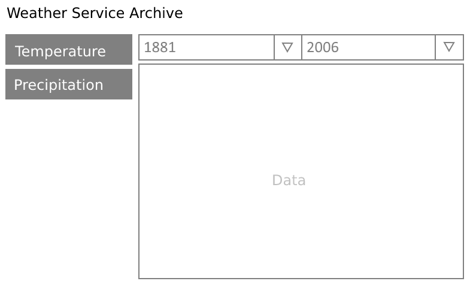

### Demo
You can see demo: https://weather-history-canvas.andreisoroka.com/

### Test task description
Develop a client for visualizing data from a web service,
which stores an archive of temperature changes and precipitation
levels over the last 120 years in one of the cities of ***.

**Development Tools:**
- HTML5/CSS3
- JavaScript without the use of third-party libraries and tools

**Code Requirements:**

- The application should be implemented in the ideology of Single Page Application
- The source code should be formatted in a uniform style and contain necessary comments
- The neatness of the source code will be evaluated along with the functionality of the application
- You can use the capabilities of the latest versions of browsers (Chrome, Firefox, IE11, Edge). There are no requirements for the minimum supported browser version.
- The files with the source code of the test task should not be obfuscated

**Application interface template**


**Technical Description of the Application**

- The application page consists of two parts - the selection of the data type and a chart visualizing the selected data.
- By default, the user should see the temperature change archive data.
- Data from IndexedDB is used to build the chart
- Data on the client is stored in two tables: temperature and precipitation
- If there is no data in the table, data for it is requested from the server.
- Data from the server is requested on demand when there has been a request for the corresponding data in the local database and they have not been found there.
- Data for each of the tables is requested from the server separately.
- A record for a single month of meteorological measurements should be stored as a separate object/record in IndexedDB.
- The server part can be organized simply as the delivery of files from a convenient web server or implementing a server on Node.js.
-  The data files that need to be used for the test task are attached to the letter.
- By default, the chart should display data for the entire period from 1881 to 2006, i.e., all data received from the server should be used (46,020 records).
- No calculations can be made on the server.
- The user should have the opportunity to specify the display period of the archive and indicate the period with an accuracy to the year.
- Use Canvas for chart display
- When generating a chart, the application interface should not "freeze" and all control elements should be available for the user to select.
- There should be no prohibitions or expectations when switching data types or selecting filter values.
- Calculations can be made in a separate WebWorker.

**Additionally**
- Initiative beyond the basic task is encouraged
- When developing functionality, emphasis should be placed on the performance and speed of both the application interface and the processing of data received from the server.

### My notices
- 2019 year
- Custom structure
- No tests
- Advanced project
- Design from task

Updates 2023: heroku is deprecated


### Initialization
```bash
git clone git@github.com:AndreiSoroka/weather-history-canvas.git;
cd weather-history-canvas;
npm install;
```
### Build
```bash
// dev server
npm run devserver;

// build
npm run build;

// buid for heroku
npm run heroku-postbuild;
npm start;
```
